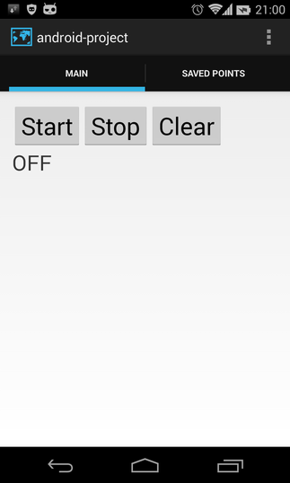

android-project
===============

Android project using GPS to gather data points and then put those coordinate points in SQLite database (having adapter with ListView in second tab showing the points)

Project need Android's `android-support-v7-appcompat` library. 
Check https://developer.android.com/tools/support-library/setup.html for setup tips.

&nbsp;

